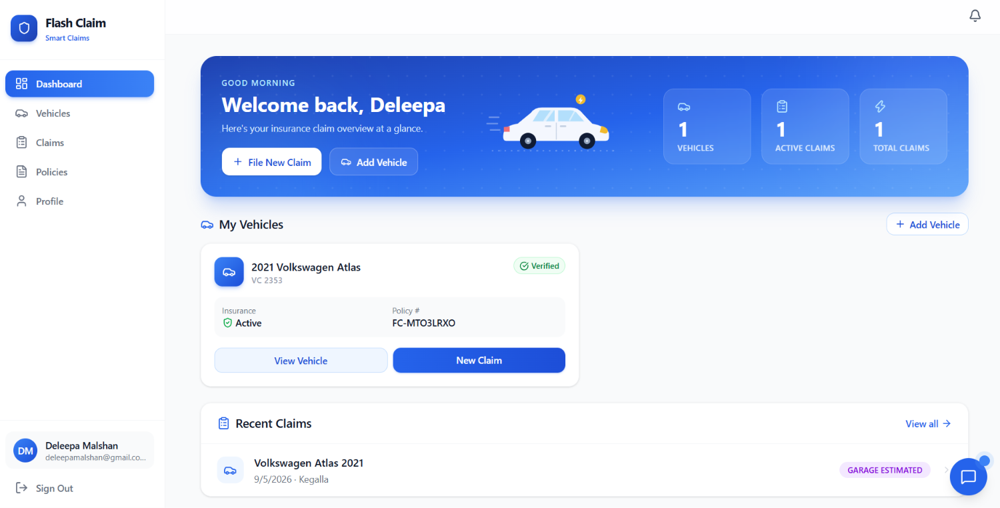

# Flash Claim — Smart Vehicle Insurance Claim System

[](https://react.dev)
[](https://vitejs.dev)
[](https://tailwindcss.com)
[](https://expressjs.com)
[](https://prisma.io)
[](https://www.typescriptlang.org)

A modern, AI-assisted motor insurance claim platform built for the Sri Lankan market. Policyholders report accidents, upload photos and documents, and track claims in real time. Garages submit itemised repair estimates. Insurers review AI damage assessments, reconcile garage quotes, detect fraud, and confirm final payouts — all in one place.



---

## Features

### Three connected roles

| Role                | What they do                                                                                               |
| ------------------- | ---------------------------------------------------------------------------------------------------------- |
| **Policyholder**    | File claims, upload images/documents, view AI damage assessment, track status, receive notifications       |
| **Garage**          | Review assigned claims, submit line-item estimates, communicate repair details                             |
| **Admin / Insurer** | Review claims, run AI analysis, reconcile garage vs AI estimates, set final claimable value, send messages |

### AI-powered workflows

* **Damage detection** — Gemini analyses uploaded vehicle photos and returns structured damage type, severity, location, and affected parts.
* **Repair estimation** — LKR-calibrated pricing engine scales parts and labour by vehicle class (bike, three-wheeler, car, van, SUV, lorry, bus, tractor) and premium-make uplift.
* **Garage reconciliation** — Compares garage line items against the AI estimate and flags overcharges, missed damage, extra items, and labour discrepancies with a divergence score.
* **Fraud scoring** — Hybrid rule + LLM scoring checks policy recency, duplicate plates, document issues, and incident/damage consistency.
* **Controlled part vocabulary** — A Sri Lankan part catalogue keeps AI outputs consistent and prices legacy damage rows correctly.

### Notifications

In-app notifications triggered automatically for:

* Document rejection with reason
* New garage estimate submitted
* Final claimable value confirmed or updated

Admins can also send manual messages to policyholders.

---

## Tech Stack

### Backend

* **Node.js** with **Express 5**
* **TypeScript** (strict)
* **Prisma ORM 6** with **SQLite** in development
* **Google Gemini API** via `@google/generative-ai`
* **JWT** authentication, **bcryptjs** password hashing
* **Railway** deployment ready (`railway.toml`, Nixpacks)

### Frontend

* **React 19** + **Vite 8**
* **TypeScript**
* **Tailwind CSS 4**
* **React Router 7**
* **Lucide React** icons

---

## Project Structure

```text
Smart-Vehicle-Insurance-Claim-System/
├── backend/
│   ├── prisma/
│   │   └── schema.prisma       # Database schema
│   ├── src/
│   │   ├── index.ts            # Express app entry
│   │   ├── routes/             # API routes (auth, claims, admin, garage, ...)
│   │   ├── middleware/         # Auth middleware for users, admins, garages
│   │   ├── services/           # Business logic & AI integrations
│   │   └── utils/              # Prisma client, Gemini helpers, upload helpers
│   └── .env                    # Environment variables
├── frontend/
│   ├── src/
│   │   ├── pages/              # Route pages
│   │   ├── components/         # Shared UI components
│   │   ├── context/            # Auth context
│   │   └── services/           # API clients
│   └── .env                    # Vite environment variables
├── project-brief.html          # One-page project brief
├── railway.toml
└── README.md
```

---

## Getting Started

### Prerequisites

* Node.js 22.17+ (recommended)
* npm or yarn
* A Google Gemini API key

### 1. Clone and install

```bash
git clone https://github.com/<your-username>/Smart-Vehicle-Insurance-Claim-System.git
cd Smart-Vehicle-Insurance-Claim-System
```

```bash
cd backend && npm install
cd ../frontend && npm install
```

### 2. Configure environment variables

**Backend** — create `backend/.env`:

```env
DATABASE_URL="file:./prisma/dev.db"
JWT_SECRET="your-strong-random-secret"
GEMINI_API_KEY="your-gemini-api-key"
PORT=5000
```

> **Important:** Use a strong `JWT_SECRET`. The app will not start safely if it is missing.

**Frontend** — create `frontend/.env`:

```env
VITE_API_BASE_URL=http://localhost:5000/api
```

### 3. Set up the database

```bash
cd backend
npx prisma db push
```

### 4. Seed the admin user

```bash
cd backend
npx tsx scripts/seedAdmin.ts
```

The default admin account is:

| Field        | Value                  |
| ------------ | ---------------------- |
| **Email**    | `admin@flashclaim.com` |
| **Password** | `Admin@FlashClaim1`    |

### 5. Run the development servers

**Backend:**

```bash
cd backend
npm run dev
```

**Frontend:**

```bash
cd frontend
npm run dev
```

Open `http://localhost:5173` and log in.

---

## Demo Accounts   

The following accounts can be used for testing the different roles in Flash Claim.

### Admin / Insurer

```text
Email:    admin@flashclaim.com
Password: Admin@FlashClaim1
```

### Garage — AutoFix

```text
Email:    autofix@gmail.com
Password: 123456
```

> **Note:** These credentials are intended for development/demo purposes. Do not use these passwords for a production deployment.

---

## Example Test Scenario

For demonstration and testing, you can use the following example claim date:

**Example Accident Date:** `September 7, 2026`

Example workflow:

1. Register or log in as a **Policyholder**.
2. Add a vehicle and its insurance policy.
3. Create a new claim using **September 6, 2026** as the accident date.
4. Upload the required vehicle damage images and documents.
5. Run the **AI Damage Analysis**.
6. Review the detected damage, affected parts, severity, and estimated repair cost.
7. Assign the claim to the **AutoFix** garage.
8. Log in using the **AutoFix garage account**.
9. Submit an itemised repair estimate.
10. Log in as the **Admin / Insurer**.
11. Review the AI assessment and garage estimate.
12. Run **Garage Reconciliation** to identify price differences, extra items, missing items, and labour discrepancies.
13. Review the **Fraud Score**.
14. Set the final claimable value.
15. The policyholder receives a notification about the updated claim status/value.

---

## Key API Endpoints

| Area          | Endpoint                                  | Description                    |
| ------------- | ----------------------------------------- | ------------------------------ |
| Auth          | `POST /api/auth/register`                 | Register a policyholder        |
| Auth          | `POST /api/auth/login`                    | Log in                         |
| Claims        | `POST /api/claims`                        | Create a claim                 |
| Claims        | `POST /api/claims/:id/analyze`            | Run AI damage analysis         |
| Garage        | `POST /api/garage/claims/:id/estimate`    | Submit garage estimate         |
| Admin         | `POST /api/admin/claims/:id/fraud-score`  | Re-run fraud scoring           |
| Admin         | `POST /api/admin/claims/:id/reconcile`    | Re-run estimate reconciliation |
| Admin         | `PATCH /api/admin/claims/:id/final-value` | Set final claimable value      |
| Admin         | `POST /api/admin/notifications`           | Send message to policyholder   |
| Notifications | `GET /api/notifications`                  | List user notifications        |

---

## Deployment

The project is configured for **Railway** deployment:

* `railway.toml` sets the backend start command and `NIXPACKS_NODE_VERSION`.
* Add the environment variables in the Railway dashboard.
* Railway will provision the database; update `DATABASE_URL` accordingly.

For production:

* Use a managed PostgreSQL database instead of SQLite.
* Set `NODE_ENV=production`.
* Ensure `JWT_SECRET` is at least 32 random characters.
* Serve the frontend build from the backend or deploy it separately (e.g. Vercel).

---

## AI Configuration

The app uses a 6-model Gemini cascade with automatic fallback. If a model fails or rate-limits, the next model is tried. Configuration lives in:

```text
backend/src/utils/gemini.ts
```

Structured output is enforced with `responseSchema` for damage analysis, fraud signals, garage reconciliation, and estimates.

---

## Roadmap

* ✅ Core claim lifecycle and three-role platform
* ✅ AI damage detection and repair estimation
* ✅ In-app notifications (auto-triggers + admin messages)
* ✅ Fraud scoring
* ✅ Garage estimate reconciliation
* 🔄 Google OAuth login and auth hardening
* ⏳ Part tiers (OEM vs aftermarket)
* ⏳ FX pricing for imported parts 

---

## Contributing

This is a solo full-stack learning and portfolio project. Pull requests and suggestions are welcome.

---

## License

MIT — free to use, modify, and deploy.
